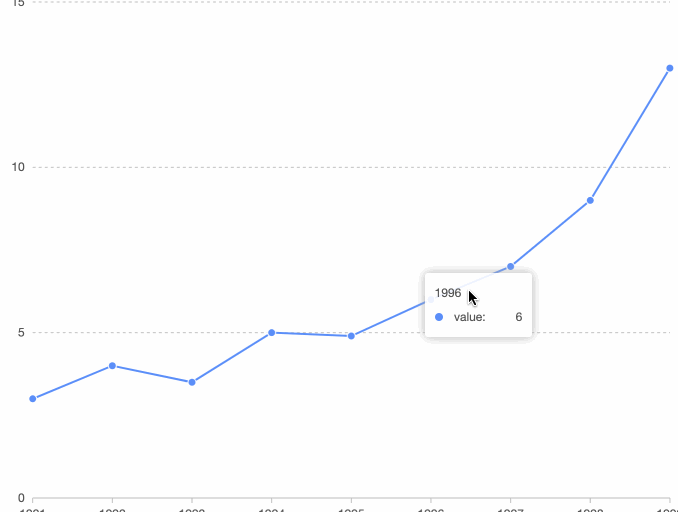
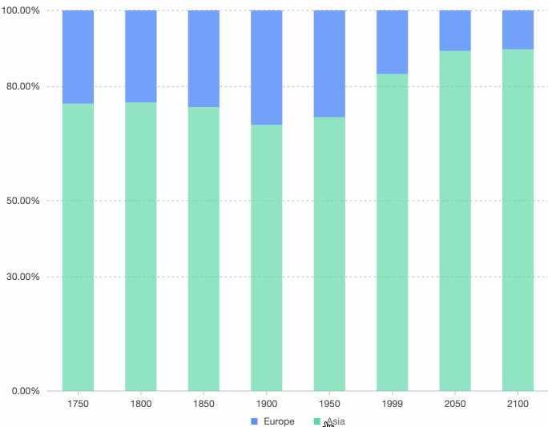
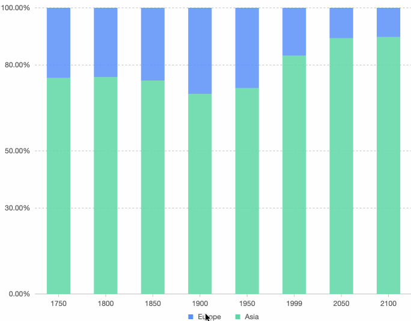
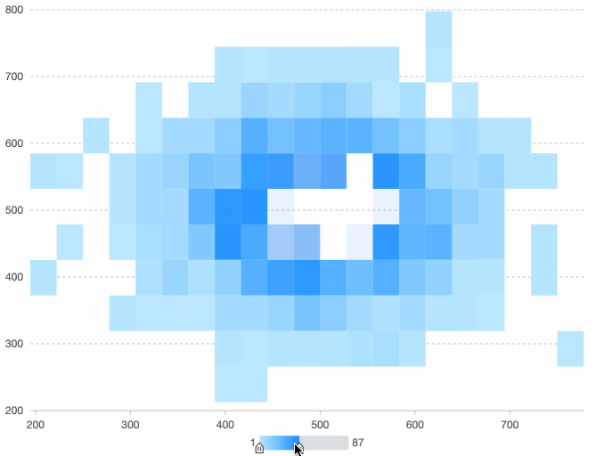
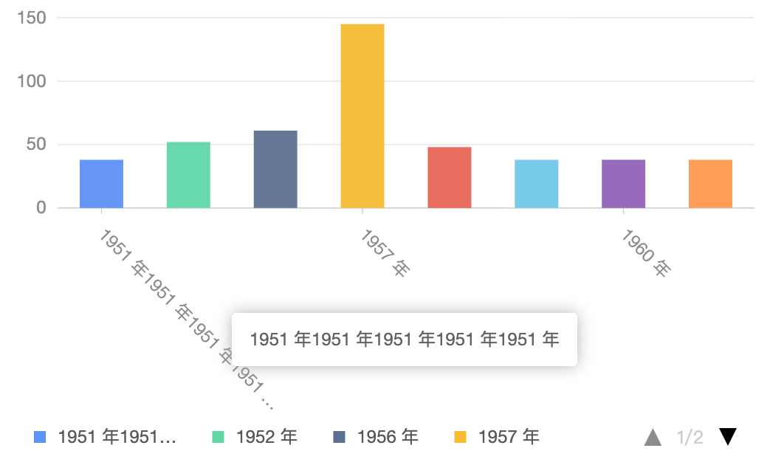

# Antv G2 可视化引擎

## Antv G2 简介

Antv G2 官网：https://g2.antv.vision/zh

版本号: 4.x

G2 一套面向常规统计图表，以数据驱动的高交互可视化图形语法，具有高度的易用性和扩展性。使用 G2，你可以无需关注图表各种繁琐的实现细节，一条语句即可使用 Canvas 或 SVG 构建出各种各样的可交互的统计图表。

## 快速上手

### 安装

```js
npm install @antv/g2 --save
```

或

```js
yarn add @antv/g2
```

### 创建 chart 对象

```js
import { Chart } from "@antv/g2";

const chart = new Chart({
  container: "c1",
  width: 600,
  height: 300,
});
```

### 载入数据

```js
chart.data();
```

### 渲染图表

```js
chart.render();
```

## api 介绍

以下 api 介绍中，只会列举常用部分

### 图表 - Chart

图标 Chart: https://g2.antv.vision/zh/docs/api/general/chart

```js
new Chart(params: ChartCfg) => View;
```

#### 参数 ChartCfg

- ChartCfg.container

  图表的挂载节点,传入 DOM 的 id，或者 DOM 实例。

- ChartCfg.autoFit (boolean)

  图表自适应容器宽高,会自动取图表容器的宽高

- ChartCfg.width (number)

  图表宽度

- ChartCfg.height (number)

  图表高度, 如果容器设置了高度了，那么容器的高度就是图标的最大高度

- ChartCfg.padding (auto' | number | number[] optional default: 'auto')

  设置图表的内边距

- ChartCfg.defaultInteractions (string[])

  配置图表默认交互

  | 交互参数          | 描述                                             |                       效果展示                       |
  | :---------------- | :----------------------------------------------- | :--------------------------------------------------: |
  | tooltip           | 鼠标在 chart 上移动时显示提示信息                |                    |
  | legend-active     | 鼠标移动到图例选项时，图例项高亮，对应的图形高亮 |          |
  | legend-filter     | 分类图例的勾选                                   |          |
  | continuous-filter | 连续图例的过滤                                   |  |
  | ellipsis-text     | 当文本过长时省略                                 |          |

- ChartCfg.pixelRatio (number)

  设置设备像素比，默认取浏览器的值 window.devicePixelRatio

- ChartCfg.renderer

  渲染引擎,canvas 或 svg,默认为 canvas

- ChartCfg.visible (boolean)

  图标是否可见

#### Chart API

- chart.forceFit()

  自动根据容器大小 resize 画布

- chart.forceFit(width: number, height: number)

  改变图表大小，同时重新渲染。

- chart.changeVisible(visible: boolean)

  显示或隐藏图表

#### View 实例

- chart.createView(cfg?: ViewCfg)

  创建子 view

- chart.removeView(view: View)

  删除 view

#### View API

View 的所有 API 都可用于 Chart

- view.animate(status: boolean)

  开启或者关闭动画

- view.data(data: Data)

  绑定数据

- view.changeData(data: Data)

  更新数据，自动重新渲染

- view.filter(field: string, condition: FilterCondition | null)

  设置数据筛选规则,Example:

  ```js
  // 过滤 'city' 字段值为【杭州】的数据
  view.filter("city", (value: any, datum: Datum) => value !== "杭州");
  // condition 为空，则表示删除过滤条件
  view.filter("city", null);
  ```

- view.scale()

  通过 scale 定义数据的类型和展示方式

- view.coordinate()

  配置坐标系

- view.axis()

  配置坐标轴组件

- view.legend()

  配置图例组件

- view.tooltip()

  配置 Tooltip 组件

- view.hideTooltip()

  隐藏 tooltip

- view.on('eventName', callback)

  监听图表事件

#### 图标生命周期 API

- view.render()

  渲染图标

- view.clear()

  清空图表上所有的绘制内容，但是不销毁图表，chart 仍可使用

- view.destroy()

  销毁图表，同时解绑事件，销毁创建的 G.Canvas 实例

### 几何图形 - Geometry

Geometry: https://g2.antv.vision/zh/docs/api/general/geometry

#### 创建几何图形

- chart.interval()

    创建矩形,用于绘制柱状图、直方图、南丁格尔玫瑰图、饼图、条形环图（玉缺图）、漏斗图等
- chart.point()

    创建点，用于绘制点图、折线图中的点等
- chart.line()

    创建线，用于绘制折线图、曲线图、阶梯线图等
- chart.area()

    创建线，用于绘制折线图、曲线图、阶梯线图等

#### 几何图形的 API
- position()

    配置 position 通道映射规则,example:
    ```js
    // 设置图表颜色为#1890ff
    chart.interval().position('x*y').color('#1890ff');
    // 根据【z】列的数据进行分组，并且用不同的颜色区分
    chart.interval().position('x*y').color('z');
    // 根据【z】列的数据进行分组，并且用指定的颜色区分
    chart.interval().position('x*y').color('z', ['#1890ff', '#5AD8A6']);
    ```
- color()

    配置 color 通道映射规则,example:
    ```js
    chart.interval().position('x*y');
    ```
- size(number)

    设置图像的像素大小
- style()

    配置图形样式

#### 常用几何图形

图标样例: https://g2.antv.vision/zh/examples/gallery

- 柱状图
  ```js
  const data = [
    { type: "type1", value: 1 },
    { type: "type2", value: 2 },
  ];
  // type对应了x轴数据,value对应了y轴数据
  chart.interval().position("type*value");
  ```
- 饼图
  ```js
  const data = [
    { type: "type1", value: 1 },
    { type: "type2", value: 2 },
  ];
  // type对应了饼图的数据项,value对应了饼图的数据值
  chart.interval().adjust("stack").position("value").color("type");
  ```
- 折线图
  ```js
  const data = [
    { type: "type1", value: 1 },
    { type: "type2", value: 2 },
  ];
  // type对应了x轴数据,value对应了y轴数据
  chart.line().position("type1*value");
  ```
- 条状图

  条状图就是 xy 轴翻转后的柱状图

  ```js
  const data = [
    { type: "type1", value: 1 },
    { type: "type2", value: 2 },
  ];
  // 坐标轴翻转
  chart.coordinate().transpose();
  // type对应了y轴数据,value对应了x轴数据
  chart.interval().position("type*value");
  ```

- 雷达图
  ```js
  const data = [
    { student: "学生1", course: "课程1", score: 60 },
    { student: "学生1", course: "课程2", score: 70 },
    { student: "学生1", course: "课程3", score: 80 },
    { student: "学生1", course: "课程4", score: 90 },
    { student: "学生2", course: "课程1", score: 69 },
    { student: "学生2", course: "课程2", score: 57 },
    { student: "学生2", course: "课程3", score: 96 },
    { student: "学生2", course: "课程4", score: 75 },
  ];
  // 生成雷达图上的点
  chart
    .point()
    .position("course*score")
    .color("student")
    .shape("circle");
  // 生成雷达图上的线
  chart.line().position("course*score").color("student");
  ```

  ## 图表实战

  G2 demo https://github.com/mayiliang/G2ChartBuilder
  ```js
  import React, { useState, useEffect, useRef } from 'react';
  import { Chart } from '@antv/g2';
  import DataSet from '@antv/data-set';

  const { DataView } = DataSet;

  const data = [
    { item: 'Design', a: 70, b: 30 },
    { item: 'Development', a: 60, b: 70 },
    { item: 'Marketing', a: 50, b: 60 },
    { item: 'Users', a: 40, b: 50 },
    { item: 'Test', a: 60, b: 70 },
    { item: 'Language', a: 70, b: 50 },
    { item: 'Technology', a: 50, b: 40 },
    { item: 'Support', a: 30, b: 40 },
    { item: 'Sales', a: 60, b: 40 },
    { item: 'UX', a: 50, b: 60 },
  ];

  const RadarChart = () => {
    const [chart, setChart]: any[] = useState();
    const ref: any = useRef();

    useEffect(() => {
      let newChart: any = chart;
      if (newChart) {
        changeData(newChart, data);
      } else {
        newChart = renderChart();
      }
      return () => {
        if (newChart) {
          newChart.destroy();
        }
      };
    }, [data]);

    const getData = (data: any[]) => {
      const dv = new DataView().source(data);
      dv.transform({
        type: 'fold',
        fields: ['a', 'b'], // 展开字段集
        key: 'user', // key字段
        value: 'score', // value字段
      });
      return dv.rows;
    };

    const renderChart = () => {
      if (ref.current) {
        const chart = new Chart({
          container: ref.current,
          autoFit: true,
          // height: 400,
          // width: 800,
          padding: 100,
          pixelRatio: window.devicePixelRatio,
        });
        chart.data(getData(data));
        chart.scale('score', {
          min: 0,
          max: 80,
        });
        chart.coordinate('polar', {
          radius: 0.8,
        });
        chart.axis('item', {
          line: null,
          tickLine: null,
          grid: {
            line: {
              style: {
                lineDash: null,
              },
            },
          },
        });
        chart.axis('score', {
          line: null,
          tickLine: null,
          grid: {
            line: {
              type: 'circle',
              style: {
                lineDash: null,
              },
            },
            alternateColor: 'rgba(0, 0, 0, 0.04)',
          },
        });

        chart
          .point()
          .position('item*score')
          .color('user')
          .shape('circle')
          .size(4)
          .style({
            stroke: '#fff',
            lineWidth: 1,
            fillOpacity: 1,
          });
        chart
          .line()
          .position('item*score')
          .color('user')
          .size(2);

        chart.render();

        setChart(chart);
        return chart;
      }
      return null;
    };

    const changeData = (chart: any, data: any[]) => {
      chart.changeData(data);
    };

    return <div style={{ height: 600 }} ref={ref}></div>;
  };

  export default RadarChart;

  ```
